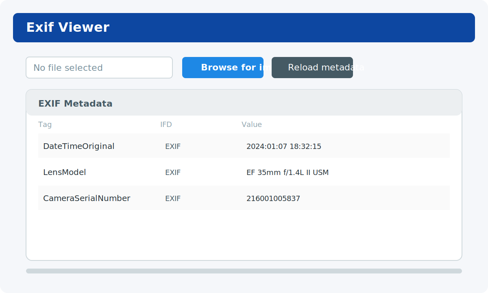
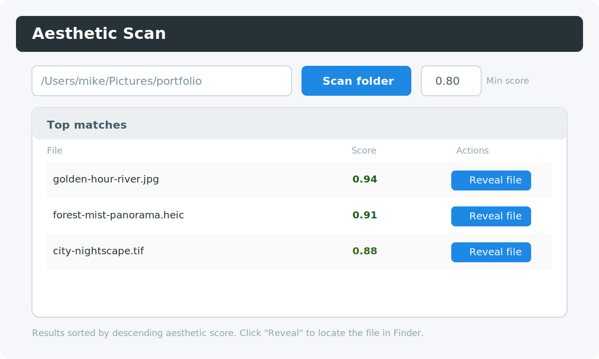

# Exif Viewer

A cross-platform desktop utility built with Tauri, React, and Rust for inspecting EXIF metadata and surfacing aesthetically scored photos from large folders.

<p align="center">
  
</p>
<p align="center">
  
</p>

## Features
- One-click EXIF inspection with a sortable table that groups IFD segments and decoded values.
- Folder scanning that ranks supported image formats (JPEG, HEIC, PNG, TIFF, AVIF, WebP, BMP) by aesthetic score.
- Native integrations such as file dialogs and “Reveal in Finder/Explorer” powered by Tauri plugins.
- Sensible error handling for unsupported formats, empty folders, or malformed metadata payloads.

## Prerequisites
- Node.js 20+ and npm 10+ for the front-end toolchain.
- Rust (stable channel) and the Tauri CLI (`npm install`) for native builds.
- macOS, Windows, or Linux with WebView2/WebKit installed depending on your platform.

## Quick Start
```bash
npm install
npm run tauri dev
```
The command spawns Vite on port 1420 and the Tauri shell. Use **Browse for image** to load EXIF data or select **Scan folder** after entering a minimum aesthetic score.

### Web-only iteration
If you just need to tweak React components, run `npm run dev` and open [http://localhost:5173](http://localhost:5173). Native dialogs are stubbed, so expect no filesystem access outside the Tauri runtime.

## Key Commands
| Command | Purpose |
| --- | --- |
| `npm run tauri dev` | Launches the desktop app with hot reload for Rust + React. |
| `npm run build` | Type-checks with `tsc` then emits the production bundle into `dist/`. |
| `npm run tauri build` | Produces signed platform binaries for distribution. |
| `cargo test` (inside `src-tauri/`) | Runs Rust unit tests when they exist. |

## Directory Overview
- `src/`: React UI (`App.tsx`, hooks, and Material UI layout).
- `src-tauri/src/`: Rust commands including EXIF parsing and aesthetic scan walker.
- `public/`, `index.html`: Static entry point shared by Vite and Tauri.
- `docs/screenshots/`: Maintained UI captures; regenerate when the layout changes.

## Testing & QA
Manual smoke tests cover multi-format uploads, invalid files, empty directories, and changes to the aesthetic threshold. See `AGENTS.md` for contributor-specific testing expectations.

## Contributing
Follow the [Repository Guidelines](AGENTS.md) for coding standards, commit conventions, and PR checklists.

## License
[MIT](LICENSE)
